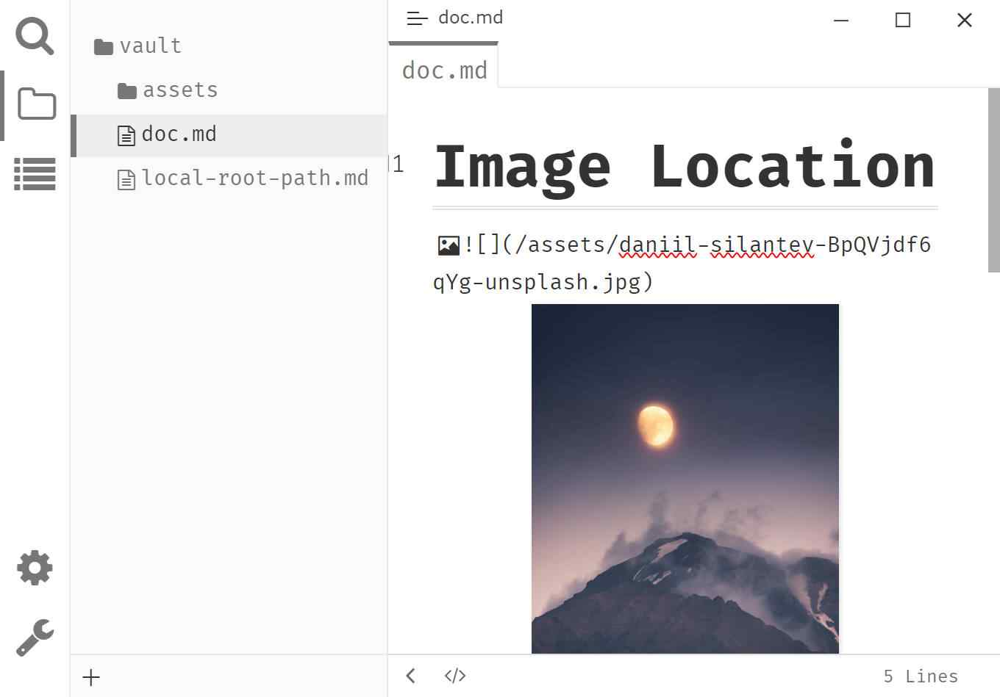

# Typora Plugin Image Location

English | [简体中文](./README.zh-CN.md)

This a plugin based on [typora-community-plugin][core] for [Typora](https://typora.io).

- Resolve image's path relative to the vault's root.

  > **Example**
  >
  > `/assets/image.png` → `{vault-path}/assets/image.png`

- Resolve Front Matter `typora-root-url` relative to the vault's root.

  > **Example**
  >
  > `typora-root-url: /assets` → `typora-root-url: {vault-path}/assets`
  >
  > The we can use the image like this: ``, it will be resolved to ``.

## Preview

## Install

1. Install [typora-community-plugin][core]
2. Open "Settings -> Plugin Marketplace" search "Image Location" then install it.

[core]: https://github.com/typora-community-plugin/typora-community-plugin
